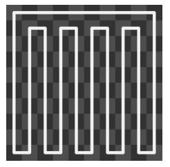
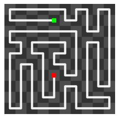
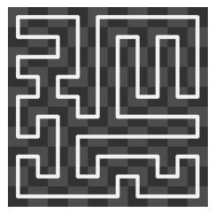

# Hamiltonian-path-cycle-generator
Creates a random hamiltonian path or cycle starting from the simple hamiltonian cycle in a grid.
The width must be an even number.

The algorithm starts by creating a simple hamiltonian cycle

Shuffle it using the backbite algorithm to get a random hamiltonan path

and eventually go back to a cycle if "type" is set to "cycle"

in index.html change the size of the canvas

in app.js change the size of a cell, the type (path/cycle) and how much you want to scramble
